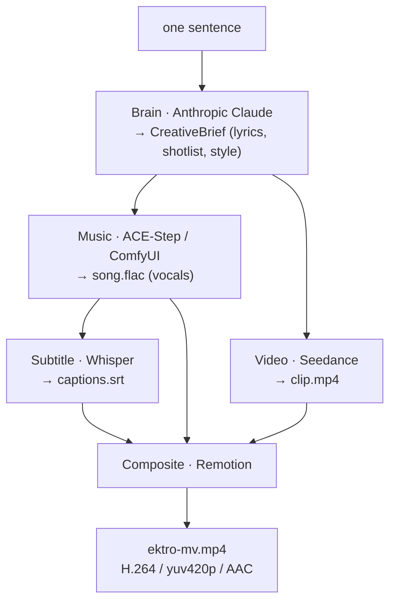

<p align="center">
  <strong>English</strong> · <a href="README.zh-CN.md">简体中文</a>
</p>

# EKTRO-MV

> One sentence → a music video. · 一句话 → 一支完整 MV。

An open-source capability from **[Ektro](https://ektroai.com/?utm_source=github&utm_medium=oss&utm_campaign=ektro_mv&utm_content=readme_en_intro)** — the sovereign runtime for personal AGI.
EKTRO-MV is a reusable creation engine, not a hosted data trap: outputs stay on the operator's machine and every external provider remains replaceable.

**中文简介：** EKTRO-MV 是 [Ektro](https://ektroai.com/?utm_source=github&utm_medium=oss&utm_campaign=ektro_mv&utm_content=readme_zh_intro) 开源的 AI 音乐视频生成引擎。输入一句中文或英文创意，即可编排歌词、音乐、画面、可选字幕与最终 MP4；产物保留在操作者自己的机器上，模型与服务商均可替换。完整中文文档请阅读 [`README.zh-CN.md`](README.zh-CN.md)。

[](https://github.com/HorizonNowhere/EKTRO-MV/actions/workflows/ci.yml)
[](LICENSE)


Open-source AI music-video engine + CLI. Type one line, get a finished MV:
LLM writes the song & shotlist, ACE-Step sings it, Seedance shoots it,
Whisper captions it, Remotion cuts it.

## Architecture



Every stage is a swappable **provider** behind a small interface in `@ektro-mv/core`
(`BrainProvider`, `MusicProvider`, `VideoProvider`, `SubtitleProvider`, `CompositeProvider`).
The defaults above are v1; add your own (Suno, Kling, local models…) by implementing the interface.

## China and international users

EKTRO-MV treats Chinese and international operators as first-class users, while being explicit about regional provider differences:

| Concern | Chinese operators | International operators |
|---|---|---|
| Creative input | Chinese prompts and `language: zh` briefs are supported | English prompts and `language: en` briefs are supported |
| Creative brain | Default prompt mode uses Anthropic; a reviewed brief removes that dependency | Use Anthropic where available, supply a reviewed brief, or implement another `BrainProvider` |
| Music | Local ComfyUI + ACE-Step keeps audio generation close to the operator | The same local path works internationally; other music providers can replace it |
| Video | The default client uses Volcengine Ark and a configurable `ARK_BASE_URL` | Confirm provider/region availability or implement another `VideoProvider` before production use |
| Data and artifacts | No hidden Ektro telemetry; outputs remain local | The same sovereignty and provider-replacement rules apply |
| Documentation | [完整简体中文 README](README.zh-CN.md) | This README is the canonical English entry point |

Provider availability, account eligibility, pricing, and generated-media terms vary by region and may change. Verify the current provider terms that apply to you before a paid run.

## Hard Prerequisites

- **Node 20+** and **pnpm 10+**
- **ComfyUI** with the ACE-Step node (GPU required for music generation)
- **ffmpeg** and **ffprobe** on `PATH` (or set `FFMPEG_PATH` / `FFPROBE_PATH` env vars)
- **ANTHROPIC_API_KEY** — Claude API key (prompt mode only; structured briefs do not need it)
- **ARK_API_KEY** — Volcengine Ark key for Seedance video generation

## Install

```bash
pnpm install
```

## Env Setup

```bash
cp .env.example .env
# fill in values, then explicitly export them before starting the CLI/MCP server
set -a
source .env
set +a
```

EKTRO-MV does not silently load arbitrary `.env` files. MCP hosts should inject credentials through their own secret configuration.

## Usage

```bash
# build the CLI first
pnpm --filter @ektro-mv/cli build

# generate a music video
node packages/cli/dist/bin.js "做一首赛博朋克 AI 觉醒神曲"

# or with output path
node packages/cli/dist/bin.js "make a cyberpunk anthem" --out mv.mp4 --workdir ./out
```

## Subtitles (optional)

The Whisper subtitle stage is **off by default**. To burn lyric captions into the MV:

```bash
# install the optional peer dependency (kept out of the default install — it's heavy)
pnpm add -w @remotion/install-whisper-cpp
# point at a writable install dir; the model downloads on first run
export EKTRO_WHISPER_INSTALL_DIR=~/.ektro-whisper   # or set in .env
```

Then run with `--subtitles`. Note: transcribing sung vocals is approximate, and
the first run downloads a whisper.cpp binary + model (~150 MB) from Hugging Face.

## Development

```bash
# run all tests
pnpm test

# typecheck all packages
pnpm -r typecheck

# build all packages
pnpm -r build
```

## Use from the HERMES agent

EKTRO-MV ships a protocol-safe stdio MCP server (`@ektro-mv/mcp`) and a Hermes skill
(`skill/ektro-mv/SKILL.md`). Hermes remains the agent host; EKTRO-MV owns the media engine and its release lifecycle.

### 1. Build the MCP server

```bash
pnpm --filter @ektro-mv/mcp build
```

### 2. Register with HERMES (one-time)

```bash
hermes mcp add ektro-mv \
  --command node \
  --args /absolute/path/to/EKTRO-MV/mcp/ektro-mv-mcp/dist/bin.js
hermes mcp test ektro-mv
```

`--command` is the executable and `--args` contains its arguments; do not quote `node + path` as one command.

After the public npm release, the version-pinned equivalent will be:

```bash
hermes mcp add ektro-mv --command npx --args -y @ektro-mv/mcp@0.2.0
```

Set `ANTHROPIC_API_KEY` (prompt mode), `ARK_API_KEY`, and `COMFYUI_URL` in the environment used to start Hermes. Set `EKTRO_WHISPER_INSTALL_DIR` only when subtitles are enabled. Never put real secrets in documentation, issue bodies, or copied shell commands.

### 3. Call the tool

First call the read-only preflight:

```json
{ "tool": "ektro_mv_doctor", "arguments": { "useBrief": false, "includeSubtitles": false } }
```

Before generation, Hermes should summarize that the run writes local files and may call paid external model APIs. Only after the user explicitly asks to proceed should it call:

```json
{
  "tool": "ektro_mv_create",
  "arguments": {
    "prompt": "做一首赛博朋克 AI 觉醒神曲",
    "skipSubtitles": true,
    "confirmedExternalCalls": true
  }
}
```

The tool returns structured artifact metadata (`runId`, `workDir`, `outputMp4`, title, and subtitle state). Each run gets an isolated directory below `EKTRO_MV_OUTPUT_ROOT`; an optional `outputDir` must be relative to that root.

For a reviewed, deterministic creative plan, pass a validated `brief` object instead of `prompt`. The two inputs are mutually exclusive.

### 4. Install the skill

Copy or symlink `skill/ektro-mv/SKILL.md` into your HERMES skills directory, or run:

```bash
hermes skills install ./skill/ektro-mv
```

The skill teaches HERMES when and how to invoke `ektro_mv_create`, and documents the
`ektro-mv "…"` CLI as a fallback when the MCP server is not available.

### Hermes Catalog path

`integrations/hermes/optional-mcps/ektro-mv/manifest.yaml` is the release-pinned catalog manifest at its intended upstream path. It must not be submitted until `@ektro-mv/mcp@0.2.0` is publicly available and the clean-install plus real-render acceptance checks pass.

## Use from other agents and workflow hosts

The MCP server supports both protocol-safe stdio and Streamable HTTP:

```bash
# stdio (most desktop and coding agents)
npx -y @ektro-mv/mcp@0.2.0

# local HTTP (Open WebUI, n8n, Dify, Langflow, Flowise, containerized LibreChat)
npx -y --package @ektro-mv/mcp@0.2.0 ektro-mv-mcp-http
```

HTTP defaults to `127.0.0.1:3210`. A non-loopback bind fails closed unless both `EKTRO_MV_MCP_TOKEN` and `EKTRO_MV_MCP_ALLOWED_HOSTS` are configured. See the [integration directory](integrations/README.md) for host-specific recipes and the [ecosystem strategy](docs/ecosystem-integration-strategy.md) for the researched upstream plan.

The MCP Registry manifest is [`mcp/ektro-mv-mcp/server.json`](mcp/ektro-mv-mcp/server.json). Registry publication happens only after the version-matched npm package is public and ownership verification succeeds.

## Why Ektro open-sourced this

EKTRO-MV is one capability at the living edge of [Ektro](https://ektroai.com/?utm_source=github&utm_medium=oss&utm_campaign=ektro_mv&utm_content=readme_en_why), not Ektro's product boundary. Ektro provides the longer-lived identity, memory, permissions, task continuity, and artifact history around replaceable models and workflows. The project is distributed artifact-first: useful source code and verifiable MP4s earn attention; operators can then explore the broader sovereign runtime without telemetry or lock-in hidden inside this engine. The source-tagged link enables campaign-level attribution on Ektro's website without adding telemetry to EKTRO-MV.

Read the full Ektro introduction in [English](docs/EKTRO.md) or [简体中文](docs/EKTRO.zh-CN.md) for the current product direction, what is already concrete here, and the boundary between EKTRO-MV and independent agent hosts.

---

## Package Structure

| Package | Role |
|---|---|
| `packages/core` | Types, interfaces, config, Anthropic brain provider |
| `packages/providers` | Seedance video, ACE-Step music, Whisper subtitle |
| `packages/composite` | SRT parser, delivery gate, Remotion composite provider |
| `packages/cli` | `runMv` orchestrator + `ektro-mv` bin |
| `apps/remotion` | Publishable `@ektro-mv/remotion` composition consumed by clean npm installs |
| `mcp/ektro-mv-mcp` | MCP server exposing preflight and confirmed creation tools over stdio and Streamable HTTP |
| `skill/ektro-mv` | Publishable Hermes skill (SKILL.md + validation tests) |
| `integrations` | Host-specific recipes, configs, security guidance, and upstream release assets |

## License
MIT
