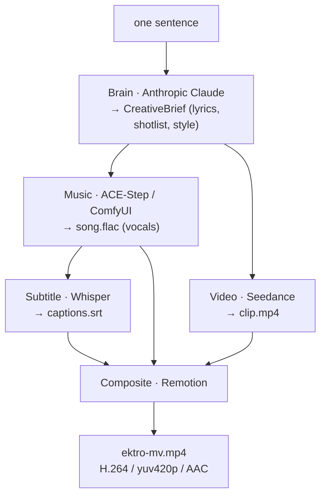

# EKTRO-MV

> One sentence → a music video.

[](https://github.com/HorizonNowhere/EKTRO-MV/actions/workflows/ci.yml)
[](LICENSE)


Open-source AI music-video engine + CLI. Type one line, get a finished MV:
LLM writes the song & shotlist, ACE-Step sings it, Seedance shoots it,
Whisper captions it, Remotion cuts it.

## Architecture



Every stage is a swappable **provider** behind a small interface in `@ektro-mv/core`
(`BrainProvider`, `MusicProvider`, `VideoProvider`, `SubtitleProvider`, `CompositeProvider`).
The defaults above are v1; add your own (Suno, Kling, local models…) by implementing the interface.

## Hard Prerequisites

- **Node 20+** and **pnpm 10+**
- **ComfyUI** with the ACE-Step node (GPU required for music generation)
- **ffmpeg** and **ffprobe** on `PATH` (or set `FFMPEG_PATH` / `FFPROBE_PATH` env vars)
- **ANTHROPIC_API_KEY** — Claude API key
- **ARK_API_KEY** — Volcengine Ark key for Seedance video generation

## Install

```bash
pnpm install
```

## Env Setup

```bash
cp .env.example .env
# then fill in values: ANTHROPIC_API_KEY, ARK_API_KEY, COMFYUI_URL, EKTRO_WHISPER_INSTALL_DIR
```

## Usage

```bash
# build the CLI first
pnpm --filter @ektro-mv/cli build

# generate a music video
node packages/cli/dist/bin.js "做一首赛博朋克 AI 觉醒神曲"

# or with output path
node packages/cli/dist/bin.js "make a cyberpunk anthem" --out mv.mp4 --workdir ./out
```

## Subtitles (optional)

The Whisper subtitle stage is **off by default** (run with `--skip-subtitles`, or it is
skipped automatically when no subtitle provider is wired). To burn lyric captions into the MV:

```bash
# install the optional peer dependency (kept out of the default install — it's heavy)
pnpm add -w @remotion/install-whisper-cpp
# point at a writable install dir; the model downloads on first run
export EKTRO_WHISPER_INSTALL_DIR=~/.ektro-whisper   # or set in .env
```

Then run **without** `--skip-subtitles`. Note: transcribing sung vocals is approximate, and
the first run downloads a whisper.cpp binary + model (~150 MB) from Hugging Face.

## Development

```bash
# run all tests
pnpm test

# typecheck all packages
pnpm -r typecheck

# build all packages
pnpm -r build
```

## Use from the HERMES agent

EKTRO-MV ships an MCP server (`@ektro-mv/mcp`) and a publishable Hermes skill
(`skill/ektro-mv/SKILL.md`) so any HERMES agent can drive the engine via one tool call.

### 1. Build the MCP server

```bash
pnpm --filter @ektro-mv/mcp build
```

### 2. Register with HERMES (one-time)

```bash
hermes mcp add ektro-mv --command "node /path/to/EKTRO-MV/mcp/ektro-mv-mcp/dist/bin.js"
```

Set the required env vars before starting the agent:
`ANTHROPIC_API_KEY`, `ARK_API_KEY`, `COMFYUI_URL`, `EKTRO_WHISPER_INSTALL_DIR`.

### 3. Call the tool

Once registered, ask HERMES to create a music video and it will call:

```json
{ "tool": "ektro_mv_create", "arguments": { "prompt": "做一首赛博朋克 AI 觉醒神曲" } }
```

The tool returns the path to the rendered MP4.

### 4. Install the skill

Copy or symlink `skill/ektro-mv/SKILL.md` into your HERMES skills directory, or run:

```bash
hermes skills install ./skill/ektro-mv
```

The skill teaches HERMES when and how to invoke `ektro_mv_create`, and documents the
`ektro-mv "…"` CLI as a fallback when the MCP server is not available.

---

## Package Structure

| Package | Role |
|---|---|
| `packages/core` | Types, interfaces, config, Anthropic brain provider |
| `packages/providers` | Seedance video, ACE-Step music, Whisper subtitle |
| `packages/composite` | SRT parser, delivery gate, Remotion composite provider |
| `packages/cli` | `runMv` orchestrator + `ektro-mv` bin |
| `apps/remotion` | Remotion `MusicVideo` composition (looped video + song + captions) |
| `mcp/ektro-mv-mcp` | MCP server exposing `ektro_mv_create` over stdio |
| `skill/ektro-mv` | Publishable Hermes skill (SKILL.md + validation tests) |

## License
MIT
