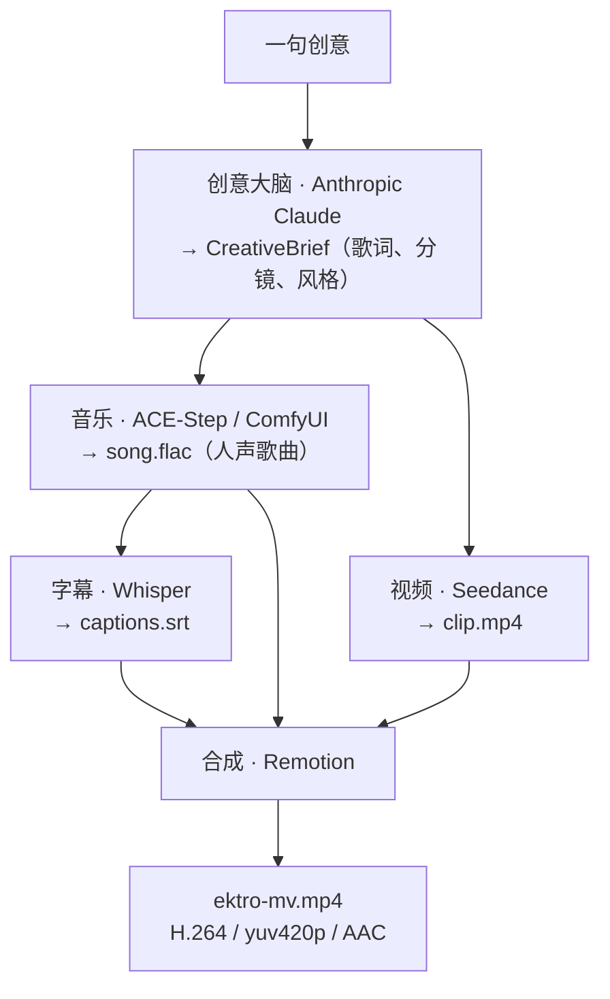

<p align="center">
  <a href="README.md">English</a> · <strong>简体中文</strong>
</p>

# EKTRO-MV

> 一句话 → 一支完整 MV。· One sentence → a music video.

EKTRO-MV 是 **[Ektro](https://ektroai.com/?utm_source=github&utm_medium=oss&utm_campaign=ektro_mv&utm_content=readme_zh_cn)** 开源的 AI 音乐视频生成引擎。它不是把用户素材锁进云端的托管黑盒：生成产物保留在操作者自己的机器上，创意大脑、音乐、视频、字幕和合成服务都可以替换。

[](https://github.com/HorizonNowhere/EKTRO-MV/actions/workflows/ci.yml)
[](LICENSE)


输入一句中文或英文创意，EKTRO-MV 会把它编排成可交付的音乐视频：LLM 编写歌词与分镜，ACE-Step 演唱，Seedance 生成画面，Whisper 可选生成字幕，Remotion 完成剪辑与交付检查。

## 架构



每个阶段都通过 `@ektro-mv/core` 中的小型接口实现：`BrainProvider`、`MusicProvider`、`VideoProvider`、`SubtitleProvider`、`CompositeProvider`。当前默认组合只是 v1；你可以实现接口，替换成其他云服务或本地模型。

## 中国用户与国际用户

EKTRO-MV 把中文与国际用户都视为一等用户，同时明确说明服务商的区域差异：

| 关注点 | 中国用户 | 国际用户 |
|---|---|---|
| 创意输入 | 支持中文 prompt 和 `language: zh` 的结构化 brief | 支持英文 prompt 和 `language: en` 的结构化 brief |
| 创意大脑 | 默认 prompt 模式使用 Anthropic；传入已审核 brief 后不需要 Anthropic | 在可用地区使用 Anthropic，或提供 brief / 自定义 `BrainProvider` |
| 音乐 | 本地 ComfyUI + ACE-Step，音频生成尽量留在操作者环境中 | 同样支持本地路径，也可以替换成其他音乐服务 |
| 视频 | 默认使用火山引擎 Ark，`ARK_BASE_URL` 可配置 | 上线前确认所在地区的账号与服务可用性，或实现其他 `VideoProvider` |
| 数据与产物 | 没有隐藏的 Ektro 遥测，成片保留在本地 | 同样遵守数据自主和服务商可替换原则 |
| 文档 | 本文件是完整中文入口 | [`README.md`](README.md) 是标准英文入口 |

服务可用地区、账号资格、价格和生成内容条款可能发生变化。每次付费生成前，请确认适用于你的最新服务条款。

## 必要环境

- **Node 20+** 与 **pnpm 10+**
- 安装 ACE-Step 节点并可正常运行的 **ComfyUI**；音乐生成需要 GPU
- `PATH` 中可用的 **ffmpeg** 与 **ffprobe**，或设置 `FFMPEG_PATH` / `FFPROBE_PATH`
- **ANTHROPIC_API_KEY**：只在一句话 prompt 模式需要；传入结构化 brief 时不需要
- **ARK_API_KEY**：默认 Seedance 视频服务需要

## 安装

```bash
pnpm install
```

## 环境变量

```bash
cp .env.example .env
# 填入所需值，然后在启动 CLI 或 MCP 之前显式导出
set -a
source .env
set +a
```

EKTRO-MV 不会静默加载任意 `.env` 文件。MCP 宿主应该通过自己的密钥配置机制注入凭证，不要把真实密钥写进 README、Issue、PR 或命令示例。

## CLI 使用

```bash
# 先构建 CLI
pnpm --filter @ektro-mv/cli build

# 生成中文音乐视频
node packages/cli/dist/bin.js "做一首赛博朋克 AI 觉醒神曲"

# 英文创意与自定义输出
node packages/cli/dist/bin.js "make a cyberpunk anthem" --out mv.mp4 --workdir ./out
```

## 字幕（可选）

Whisper 字幕阶段默认关闭。需要把歌词字幕烧录进视频时：

```bash
pnpm add -w @remotion/install-whisper-cpp
export EKTRO_WHISPER_INSTALL_DIR=~/.ektro-whisper
```

随后使用 `--subtitles`。首次运行会下载 whisper.cpp 与模型，演唱人声的自动转写也可能存在误差，因此字幕应在正式交付前人工检查。

## MCP：接入 Agent 与工作流平台

EKTRO-MV 提供两个工具：

- `ektro_mv_doctor`：只读检查 Node、API Key、ComfyUI、ffmpeg/ffprobe 与可选字幕依赖。
- `ektro_mv_create`：生成最终 MP4，会写入本地文件并可能调用付费外部 API。

本地桌面或编码 Agent 使用 stdio：

```bash
npx -y @ektro-mv/mcp@0.2.0
```

Open WebUI、n8n、Dify、Langflow、Flowise 或 Docker 化 LibreChat 等平台使用 Streamable HTTP：

```bash
npx -y --package @ektro-mv/mcp@0.2.0 ektro-mv-mcp-http
```

HTTP 默认只监听 `127.0.0.1:3210`。绑定非本机地址时，必须同时配置 `EKTRO_MV_MCP_TOKEN` 与 `EKTRO_MV_MCP_ALLOWED_HOSTS`。不要把本地静态 Token 入口直接暴露到公网。

生成工具必须收到：

```json
{
  "prompt": "做一首赛博朋克 AI 觉醒神曲",
  "skipSubtitles": true,
  "confirmedExternalCalls": true
}
```

`confirmedExternalCalls: true` 只能在用户已了解本地写入、外部服务和可能费用，并明确批准当前运行后设置。不能把它做成平台的隐形默认值。

## 接入 Hermes Agent

本地源码方式：

```bash
pnpm --filter @ektro-mv/mcp build
hermes mcp add ektro-mv \
  --command node \
  --args /absolute/path/to/EKTRO-MV/mcp/ektro-mv-mcp/dist/bin.js
hermes mcp test ektro-mv
```

npm 0.2.0 正式发布后：

```bash
hermes mcp add ektro-mv --command npx --args -y @ektro-mv/mcp@0.2.0
```

先调用 `ektro_mv_doctor`，再向用户说明外部调用边界并取得确认。Hermes 的上游目录文件位于 [`integrations/hermes/optional-mcps/ektro-mv/manifest.yaml`](integrations/hermes/optional-mcps/ektro-mv/manifest.yaml)。

## 其他开源生态

已准备的接入资产包括：

- OpenClaw 原生工具插件与 ClawHub 发布结构
- goose Recipe 与未来 MCP 目录路径
- LibreChat Docker/HTTP 配置
- Open WebUI、n8n、Dify、Langflow、Flowise 的安全 HTTP 指南
- Gemini CLI、Qwen Code、OpenCode、Continue、Cline 的 MCP 配置
- 官方 MCP Registry `server.json`

请从[中文集成索引](integrations/README.zh-CN.md)进入；英文技术资产保留各上游要求的精简格式。

## 开发与验证

```bash
pnpm build
pnpm lint
pnpm typecheck
pnpm test
pnpm verify:packages
pnpm verify:deploy
pnpm verify:docs
pnpm verify:integrations
```

## 为什么 Ektro 开源 EKTRO-MV

EKTRO-MV 是 [Ektro](https://ektroai.com/?utm_source=github&utm_medium=oss&utm_campaign=ektro_mv&utm_content=readme_zh_why) 能力边缘上的一个开源能力，不是 Ektro 的全部产品边界。Ektro 正在建设一个面向个人 AGI 的自主运行时，让身份、记忆、权限、任务连续性、关系和作品历史在模型与工具更换后仍能由用户掌控。

这个项目坚持 artifact-first：先交付可检查的代码、运行证据与 MP4，再邀请真正需要更长期 AI 连续性的用户了解 Ektro。带来源参数的链接用于网站侧归因；EKTRO-MV 引擎本身不加入隐藏遥测。

阅读 [Ektro 完整中文介绍](docs/EKTRO.zh-CN.md)，了解当前已落地能力、长期方向，以及 EKTRO-MV 与 Hermes、OpenClaw 等独立 Agent 宿主之间的边界。

## 目录结构

| 目录 | 作用 |
|---|---|
| `packages/core` | 类型、Provider 接口、配置与创意大脑 |
| `packages/providers` | Seedance、ACE-Step 与可选 Whisper Provider |
| `packages/composite` | SRT 解析、交付门禁与 Remotion 合成 |
| `packages/cli` | `runMv` 编排器与 `ektro-mv` CLI |
| `apps/remotion` | 可发布的 Remotion composition 入口 |
| `mcp/ektro-mv-mcp` | stdio / Streamable HTTP MCP 服务 |
| `skill/ektro-mv` | Hermes Skill 与验证测试 |
| `integrations` | 各宿主配置、发布规则、安全说明和上游资产 |

## 许可证

MIT
